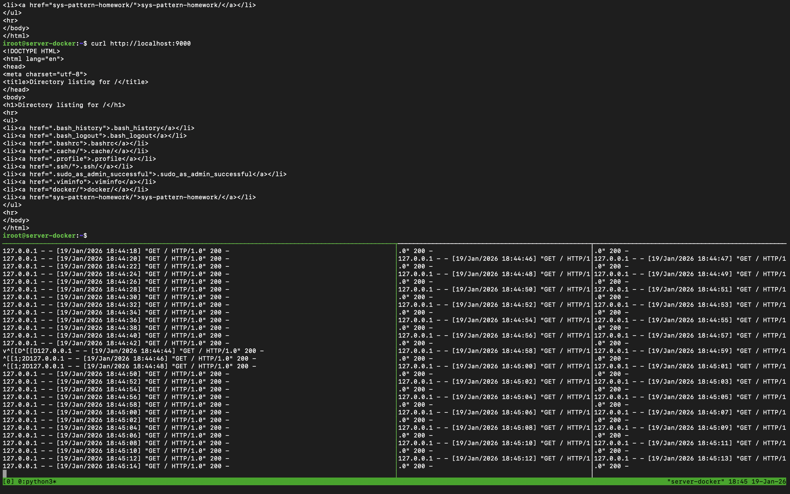
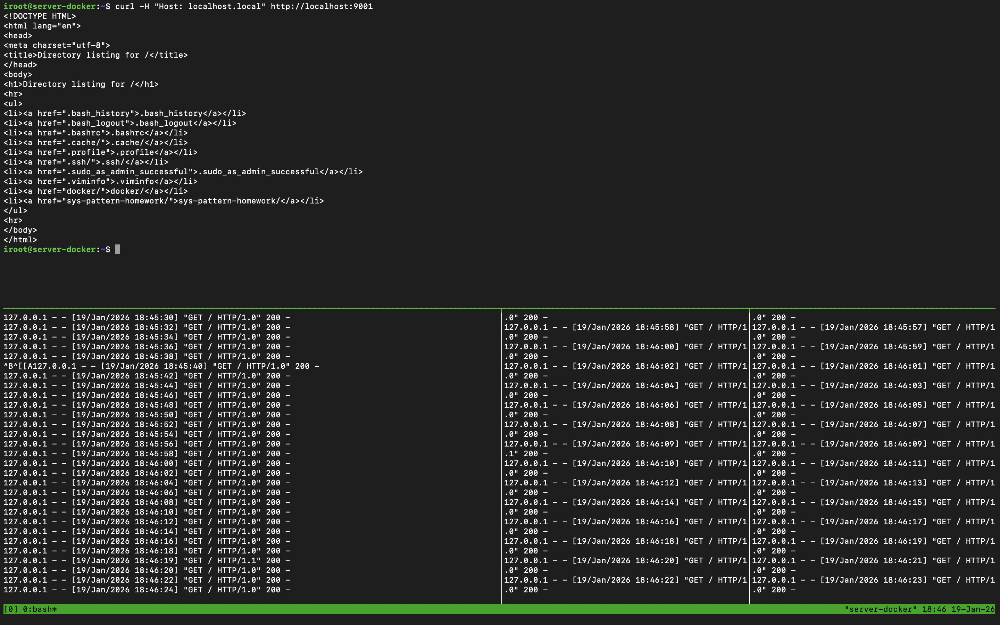

# Домашнее задание к занятию 2  
## «Кластеризация и балансировка нагрузки»

**Выполнил:** Авдеев Илья

## Задание 1. Балансировка Round Robin на 4 уровне (L4)

### Условие
- Запустите два simple python сервера на своей виртуальной машине на разных портах
- Установите и настройте HAProxy, воспользуйтесь материалами к лекции по ссылке
- Настройте балансировку Round-robin на 4 уровне.
- На проверку направьте конфигурационный файл haproxy, скриншоты, где видно перенаправление запросов на разные серверы при обращении к HAProxy.

### Запуск python серверов

```bash
python3 -m http.server 8001
python3 -m http.server 8002
````

---

### Конфигурация HAProxy (L4)

[haproxy/haproxy-l4.cfg](haproxy/haproxy-l4.cfg)

---

### Проверка работы

```bash
curl http://localhost:9000
```



---

## Задание 2. Weighted Round Robin на 7 уровне (L7)

### Условие

- Запустите три simple python сервера на своей виртуальной машине на разных портах
- Настройте балансировку Weighted Round Robin на 7 уровне, чтобы первый сервер имел вес 2, второй - 3, а третий - 4
- HAproxy должен балансировать только тот http-трафик, который адресован домену example.local
- На проверку направьте конфигурационный файл haproxy, скриншоты, где видно перенаправление запросов на разные серверы при обращении к HAProxy c использованием домена localhost.local и без него.

---

### Запуск python серверов

```bash
python3 -m http.server 8001
python3 -m http.server 8002
python3 -m http.server 8003
```

---

### Настройка доменного имени

В файл `/etc/hosts` добавлена запись:

```text
127.0.0.1 example.local
```

---

### Конфигурация HAProxy (L7 + ACL)

[haproxy/haproxy-l7-weighted.cfg](haproxy/haproxy-l7-weighted.cfg)

---

### Проверка работы

#### Запрос с доменом example.local

```bash
curl http://example.local:9001
```

Трафик распределяется между серверами с учётом заданных весов.

---

#### Запрос без домена example.local

```bash
curl http://localhost:9001
```


